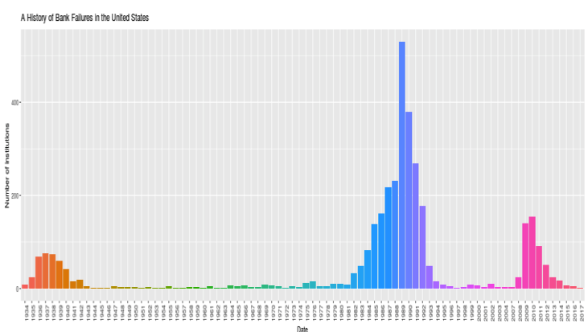

```{r setup, include=FALSE}
knitr::opts_chunk$set(echo = FALSE)
```

## Presentation

This project is related to a kaggle kernet which studied every bank failure in the 
United States since the Great Depression.

## Interesting Links

- To learn more, see it on [kaggle](https://www.kaggle.com/fdic/bank-failures).
- R scripts (server.R & ui.R) on [Github](https://www.kaggle.com/fdic/bank-failures).
- To interact with the demo, let's move on [Shiny]( https://tanguylevent.shinyapps.io/bank_failures/)

##  Some R codes...but find the rest on Github

```{

sidebarLayout(

        sidebarPanel( selectInput("type","Select a bank institution", 
         choices = c("COMMERCIAL BANK","SAVINGS ASSOCIATION","SAVINGS BANK")))
                   
                  )

```

```{

 output$distPlot <- renderPlot({
        data <- dt.agg()
        ggplot(data, aes(Date,Loss, fill=Date)) +
         geom_bar(stat = "identity") +
         theme(axis.text.x = element_text(angle = 90, hjust = 1)) +
         guides(fill=FALSE) +
         xlim(1980,2020) +
         ylab("Loss (in billion)") +
         ggtitle("A History of Bank losses in the United States since 1986")
        })

```
## An output...but find the rest on Github

